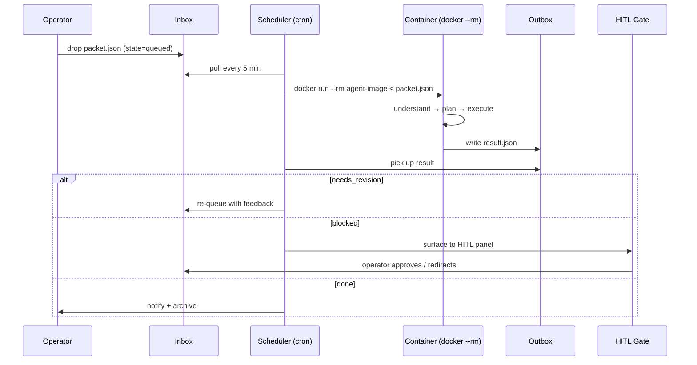
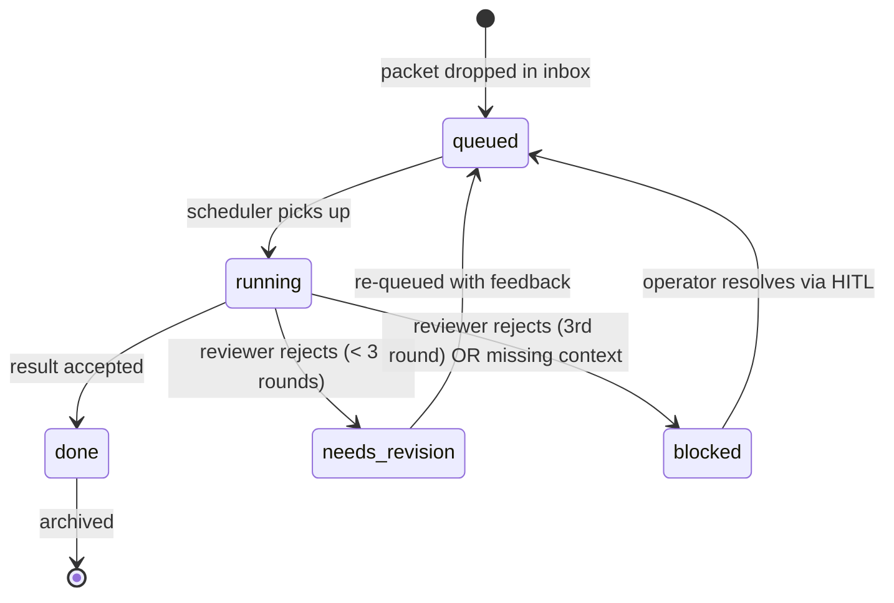

# Factory Cycle

How a packet moves from idea to delivered result inside the venture factory.

## The Cycle



## Packet States



## Rules

| Rule | Detail |
|------|--------|
| One agent per flock | `flock -n` on agent line prevents parallel double-runs |
| Ephemeral containers | `docker run --rm` — no state leaks between packets |
| Max 3 revision rounds | After round 3, packet goes to `blocked`, not back to `queued` |
| HITL = visual gate | Every blocked packet surfaces on the Nerve Center panel; approval there is final — no second confirmation |
| Kill criterion | Stop spending on an agent line when: cost is ongoing AND no active signal from that line |

## File Layout

```
/opt/factory/
  inbox/          # operator drops packets here
  outbox/         # agent writes results here
  archive/        # scheduler moves done packets here
  logs/           # one log per packet execution
  agents/         # agent definitions (one dir per agent)
    builder/
    reviewer/
    closer/
  scheduler.py    # cron entry point
```

## Adding a New Agent

1. Create `agents/<name>/run.py` — reads `packet.json` from stdin, writes result to stdout
2. Add a line to `scheduler.py` pointing at the new agent dir
3. Drop a test packet in `inbox/` and watch `outbox/`

No restart needed — the scheduler picks up new agent dirs on the next cron tick.
