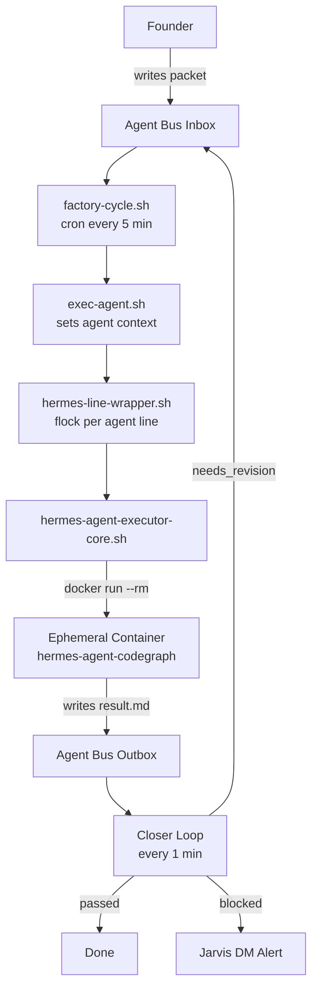

# How the Factory Works

The factory is a multi-agent system that executes build work autonomously. A human writes a packet (a structured task description), drops it in an inbox, and an agent picks it up, executes it in an ephemeral Docker container, and a reviewer validates the result.

## Architecture

## Key design decisions

**Ephemeral executors, not persistent agents.**
Each packet runs in a fresh `docker run --rm` container. No state leaks between tasks. The container is destroyed when the task completes. This eliminates entire classes of bugs (stale context, memory corruption, dependency drift).

**One lock per agent line.**
`flock` ensures only one executor runs per agent line at a time. Line A (builder + reviewer) and Line B (strategist + creative) run concurrently but never overlap within a line.

**File-based agent bus.**
The inbox and outbox are directories of Markdown files. No message broker, no database. Every packet is readable, editable, and debuggable with `cat`. The simplest thing that works at this scale.

**Multi-pass execution for complex tasks.**
Packets can opt into `multi_pass: true`. The agent runs three phases — `understand`, `plan`, `execute` — with state persisted between cron ticks. Complex implementations don't timeout; they checkpoint.

## Agent lines

| Line | Agents | Role |
|---|---|---|
| Line A | Ergon (builder) + Argus (reviewer) | Implementation — code, migrations, tests |
| Line B | Caliope (strategist) + Atena (creative) | Strategy, copy, creative direction |
| Jarvis | Personal assistant | Discord interface, briefings, HITL alerts |

## What the factory can do today

- Write and test Python code (FastAPI, scraping, ML pipelines)
- Review its own output and request revisions
- Escalate blocked tasks to the founder via Discord DM
- Self-heal the ML model baseline (Brier score monitoring)
- Generate daily marketing briefings and content drafts
- Research topics deeply on request (`!deep` command)
