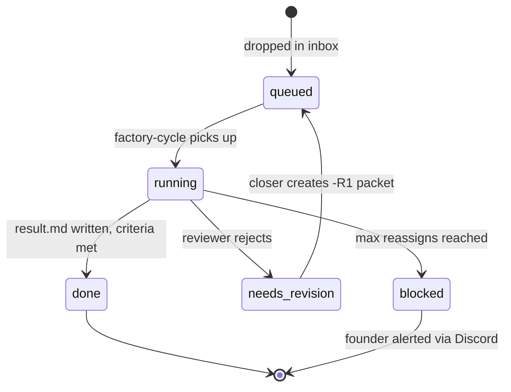

# Packet Protocol

A packet is the unit of work in the factory. It's a Markdown file with YAML frontmatter that tells the agent who it is, what to do, and what success looks like.

## Anatomy of a packet

```markdown
---
task_id: ERGON-PCB-101-monorepo-scaffold
line: line-a
agent_role: ergon
origin: founder
tool_bundle: [bash, read_file, write_file, run_tests]
memory_scope: pc-builder-br
multi_pass: false
---

## Context
We are building FPSReal — a PC hardware comparator for the Brazilian market.
This is Sprint 1, Task 1.

## Objective
Scaffold the monorepo at /opt/pc-builder-br/ with the directory structure,
Docker Compose, and empty service stubs for the ingestion API and web frontend.

## Acceptance criteria
- [ ] /opt/pc-builder-br/ exists with correct structure
- [ ] docker-compose.yml defines pcb_db (port 5434), ingestion API (8100), web (3100)
- [ ] README.md explains how to start the stack
- [ ] All acceptance criteria are checked before Status: done

## On completion
Copy ERGON-PCB-102 from work/pc-builder-br/packets/ to inbox/ergon/
```

## Frontmatter fields

| Field | Values | Purpose |
|---|---|---|
| `task_id` | `AGENT-PROJECT-NNN-slug` | Unique identifier, used for result routing |
| `line` | `line-a`, `line-b` | Which agent line handles this |
| `agent_role` | `ergon`, `argus`, `caliope`, `atena` | Which specific agent |
| `origin` | `founder`, `agent` | Who created the packet |
| `tool_bundle` | list | Which tools the agent can use |
| `memory_scope` | string | Scoped memory context for this project |
| `multi_pass` | bool | Enable understand→plan→execute phases |

## Lifecycle



## Naming convention

```
{AGENT}-{PROJECT}-{NNN}-{slug}

ERGON-PCB-101-monorepo-scaffold
ARGUS-PCB-101-R1-review-scaffold
CALIOPE-ZS-001-positioning-brief
```

## Writing good packets

**Be specific about acceptance criteria.** The agent checks these literally before marking done. Vague criteria produce vague results.

**Include context, not just instructions.** The agent doesn't know your venture's history. Tell it what this is, why it matters, and what came before.

**Chain packets explicitly.** If this packet should trigger the next one, say so in "On completion". Don't assume the agent will figure out sequencing.

**Keep scope small.** One packet = one deployable unit of work. If it takes more than 2 hours to execute manually, split it.
