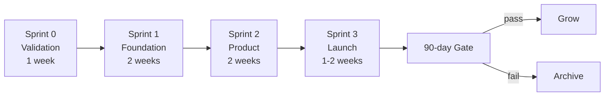

# Sprint Structure

## Overview

Total: **6–8 weeks from idea to launched product with gate metrics.**

---

## Sprint 0 — Validation (1 week)

**Output:** CONDITIONAL GO / NO-GO document

**Factory work:**
- Caliope: competitive landscape + moat analysis
- Ergon: technical feasibility spike (can we build the hard parts?)

**Founder work:**
- Talk to 3 potential users or customers
- Write kill criteria and gate metrics
- Decide: go or no-go

**Gate:** Founder explicitly writes GO or NO-GO. No implicit continuation.

---

## Sprint 1 — Foundation (2 weeks)

**Output:** Running infrastructure with real data flowing

**Factory work:**
- Ergon: monorepo scaffold, database schema, seed data
- Ergon: ingestion pipeline (data comes in and gets stored)
- Argus: reviews every piece, enforces TDD

**Founder work:**
- Unblock external dependencies (API keys, domain, payment setup)
- ≤ 5h/week

**Gate:** Data is flowing. Schema is stable. Nothing built on sand.

---

## Sprint 2 — Product (2 weeks)

**Output:** Working product that a user could use

**Factory work:**
- Ergon: core user-facing features
- Atena: landing page copy + waitlist
- Caliope: positioning document

**Founder work:**
- Review Atena's copy (HITL — human approves all public-facing content)
- Share with 3 beta users for feedback
- ≤ 8h/week

**Gate:** At least 1 person who isn't the founder has used it and given feedback.

---

## Sprint 3 — Launch (1–2 weeks)

**Output:** Public launch with distribution

**Factory work:**
- Ergon: production hardening, monitoring, error handling
- Atena: launch content (social posts, email sequence)
- Caliope: launch strategy + channel prioritisation

**Founder work:**
- Execute distribution (post, email list, communities)
- 15–20h launch week only — this is the exception
- Monitor metrics daily

**Gate:** Product is live. Audience knows it exists.

---

## After launch: operations mode

Post-launch, the venture moves to **operations mode:**

- Founder time: ≤ 10h/week
- Factory: handles feature requests, content, monitoring
- Weekly: Caliope retrospective + next week's priorities
- Monthly: gate metrics review against 90-day targets
